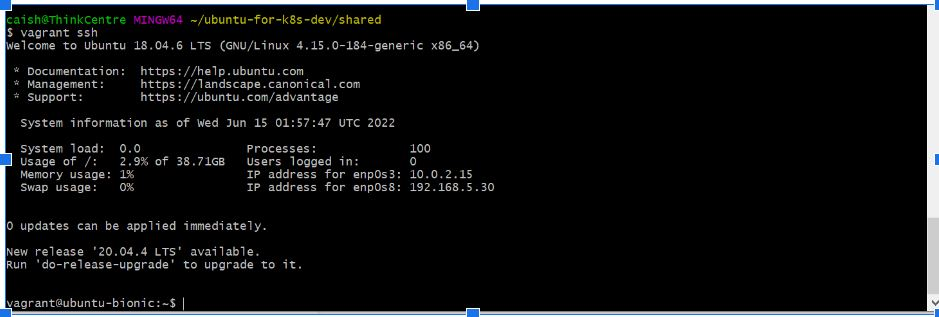

Vagrant and Virtualbox with Ubuntu and the setup of passwordless login via Putty on Windows 10

# Preinstalled software installed on your Windows 10
- Vagrant has been installed: if not, go to [download Vagrant](https://www.vagrantup.com/downloads)
- VirtualBox has been installed: if not, go to [download VirtualBox](https://www.virtualbox.org/wiki/Downloads)
- PuTTYgen has been installed: if not, go to [install PuTTYgen](https://www.puttygen.com/)
- PuTTY has been installed: if not, go to [install PuTTY](https://www.putty.org/)
- Git Bash has been installed: if not, go to [Git Bash for windows](https://gitforwindows.org/)

#  Get to know these tools in one statement
- Vagrant: Hashcorp's tool to manage Virtual machines
- VirtualBox: A kind of hypervisor from Oracle
- PuTTYgen: A tool to manage/convert public/private keys
- PuTTY: A tool for SSH and Telnet terminal on Windows
- Git Bash: A tool to run Git commands from Windows
- Ubuntu: A kind of Linux distribution

# Install Ubuntu on VirtualBox 

## Create a directory to host your future virtual machine envornment

  - start git bash and go to your home directory ($ is git bash command prompt)
  - $ **cd ~**
  - $ **mkdir ./ubuntu-for-k8s-dev && cd ./ubuntu-for-k8s-dev && mkdir shared && cd ./shared && pwd**  
    /c/Users/caish/ubuntu-for-k8s-dev/shared
  - $ **touch Vagrantfile**
## Install Ubuntu on VirtualBox via Vagrant command line tool
  - From Git Bash, run Vagrant to install Ubuntu
  
    $ **vagrant box add ubuntu/bionic64**
    
    ==> box: Loading metadata for box 'ubuntu/bionic64'
        box: URL: https://vagrantcloud.com/ubuntu/bionic64
        
    ==> box: Adding box 'ubuntu/bionic64' (v20220610.0.0) for provider: virtualbox  
        box: Downloading: https://vagrantcloud.com/ubuntu/boxes/bionic64/versions/20220610.0.0/providers/virtualbox.box
        
    Download redirected to host: cloud-images.ubuntu.com
        box:  
    ==> box: Successfully added box 'ubuntu/bionic64' (v20220610.0.0) for 'virtualbox'!  
    
  - From Git Bash, run Vagrant to check listed Ubuntu
  
    $ **vagrant box list | grep bionic64**
    
    ubuntu/bionic64 (virtualbox, 20210319.0.0)
    
    **ubuntu/bionic64 (virtualbox, 20220610.0.0)**^1]: Newly installed ubuntu/bionic64

## Initialize newly installed Virtual Machine Ubuntu   
  - From Git Bash, run vagrant init command

    $ **vagrant init ubuntu/bionic64**
    
    `Vagrantfile` already exists in this directory. Remove it before
     running `vagrant init`.  

  - Try again, with --force option to override Vagrantfile

    caish@ThinkCentre MINGW64 ~/ubuntu-for-k8s-dev/shared
    
    $ **vagrant init ubuntu/bionic64 --force**
    
    A `Vagrantfile` has been placed in this directory. You are now
    ready to `vagrant up` your first virtual environment! Please read
    the comments in the Vagrantfile as well as documentation on
    `vagrantup.com` for more information on using Vagrant.
   
   - After the init, Vagrantfile should have been to ready for startup, we will startup 
     first and then add more customized configuration options. 

## Startup the Virtual Machine Ubuntu
  - From Git Bash, run vagrant up command, 
    $ **vagrant up**
    
    Bringing machine 'default' up with 'virtualbox' provider...  
    ==> default: Importing base box 'ubuntu/bionic64'...
    ==> default: Matching MAC address for NAT networking... 
    ==> default: Checking if box 'ubuntu/bionic64' version '20220610.0.0' is up to date...  
    ==> default: Setting the name of the VM: shared_default_1655256898670_5796  
    ==> default: Clearing any previously set network interfaces...  
    ==> default: Preparing network interfaces based on configuration...  
        default: Adapter 1: nat  
    ==> default: Forwarding ports...  
        default: 22 (guest) => 2222 (host) (adapter 1)  
    ==> default: Running 'pre-boot' VM customizations...  
    ==> default: Booting VM...  
    ==> default: Waiting for machine to boot. This may take a few minutes...  
        default: SSH address: 127.0.0.1:2222  
        default: SSH username: vagrant  
        default: SSH auth method: private key  
        default:  
        default: Vagrant insecure key detected. Vagrant will automatically replace  
        default: this with a newly generated keypair for better security.  
        default:  
        default: Inserting generated public key within guest...  
        default: Removing insecure key from the guest if it's present...  
        default: Key inserted! Disconnecting and reconnecting using new SSH key...  
    ==> default: Machine booted and ready!  
    ==> default: Checking for guest additions in VM...  
        default: The guest additions on this VM do not match the installed version of
        default: VirtualBox! In most cases this is fine, but in rare cases it can
        default: prevent things such as shared folders from working properly. If you see
        default: shared folder errors, please make sure the guest additions within the
        default: virtual machine match the version of VirtualBox you have installed on
        default: your host and reload your VM.
        default:
        default: Guest Additions Version: 5.2.42
        default: VirtualBox Version: 6.1  
    ==> default: Mounting shared folders...  
        default: /vagrant => C:/Users/caish/ubuntu-for-k8s-dev/shared

## edit Vagrantfile to configure customized setup
  - Set up private_network ip to internal valid ip address
  - Resize the virtual machine's memmory, it should be no more than 1/2 of Windows host's total memory
  - Sample actual setup lines should be similar to following:

    $ **grep -v '^ *#' Vagrantfile**  
    Vagrant.configure("2") do |config|  
      config.vm.box = "ubuntu/bionic64"  
      config.vm.network "private_network", ip: "192.168.5.30"  
      config.vm.provider "virtualbox" do |vb|  
        vb.memory = "8192"  
      end  
    end  
    
 ## Apply updated configuration with vagrant provision command
 
    - Apply new updates
    
      $ vagrant provision

      caish@ThinkCentre MINGW64 ~/ubuntu-for-k8s-dev/shared
      
      - when running provision command, the virtual maching should be already started up, otherwise you will get following message:
      
      ==> default: VM is not currently running. Please, first bring it up with `vagrant up` then run this command.

## Login to confirm the virtual machine is accessable 

  $ **vagrant ssh**  
    
  
  ## Congratulations, now you have successfully used Vagrant to setup ubuntu virtual machine on Virtualbox

